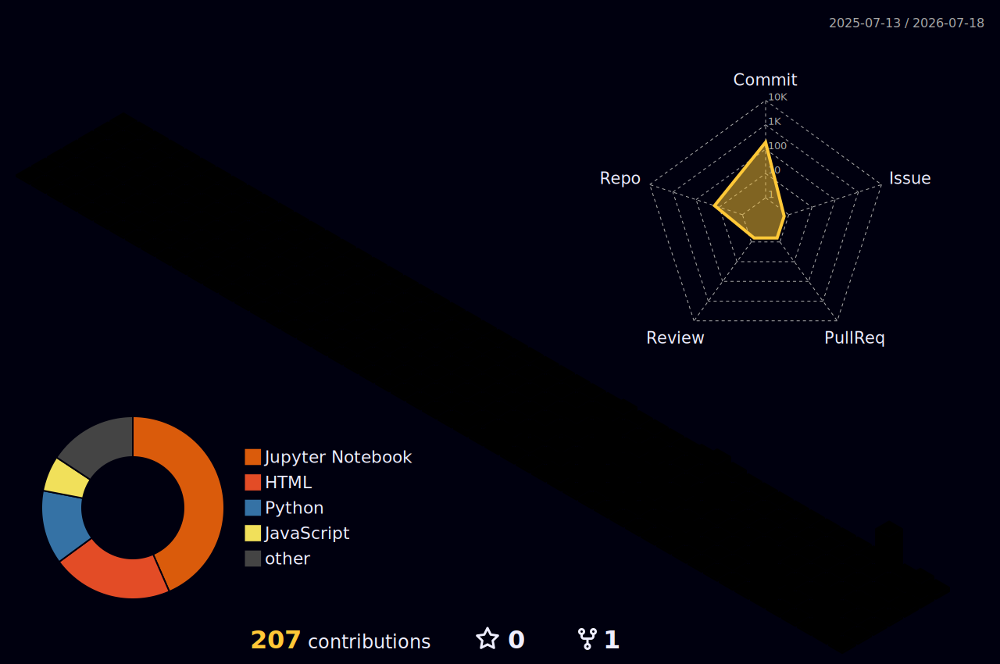

<div align="center">



<br/>

<a href="https://git.io/typing-svg">
  
</a>

<br/>

[](https://linkedin.com/in/rajeev-rathore01)
[](mailto:cs23rajeev@rbmi.in)
[](https://github.com/RajeevRathore7055)

</div>

<br/>

## Introduction

I'm an Agentic AI Intern at **Innomatics Research Labs**, currently building agent-based
AI systems with LangChain and LangGraph, backed by FastAPI services and AWS infrastructure.
My work sits at the intersection of **mathematics and machine learning** <br><br>I like problems
that reduce cleanly to an objective function and systems that reduce cleanly to an API
contract. Final-year B.Tech CSE student at RBMI Group of Institutions (AKTU), building
toward a career designing and shipping real AI agent architectures.

<br/>

## Short Bio

- 🎓 Final-year B.Tech CSE student (2023–2027) at RBMI Group of Institutions, AKTU Lucknow
- 🤖 Agentic AI Intern at Innomatics Research Labs — LangChain, LangGraph, FastAPI & AWS
- 📐 Strong foundation in Linear Algebra, Calculus & core ML algorithms
- 🛠️ Shipped ML platforms, deployed AI agents and led a 50+ student robotics workshop
- ♟️ Approaches problems the way I approach chess — A few moves ahead

<br/>

## Current Focus

```
Currently Learning     → Advanced LangGraph orchestration, RAG pipelines & Transformer internals
Currently Building     → AI Interview Agent (voice), Coding Notes RAG Agent & LinkedIn Post Agent
Research Interests     → Agentic architectures, applied ML & Mathematical foundations of learning
Current Tech Stack     → Python · FastAPI · LangChain · LangGraph · Hugging Face · AWS · Docker
```

<br/>

## About Me

I specialize in programming and software development with a particular pull toward
**data analytics and machine learning**. My foundation in mathematics — linear algebra
and calculus — isn't academic box-ticking; it's the lens I use to actually understand
*why* a model works & not just how to call `.fit()`.

Day to day, that shows up as: building AI agents at Innomatics Research Labs, deploying
ML models behind REST APIs and picking apart algorithms (Linear-Regression, Logistic-Regression, SVMs,
Decision-Trees, Naive-Bays, KNN, CNN, RNN & Perceptron) until the math behind them is boring and obvious. I've run a
Robotics & Automation workshop for 50+ students, worked across the MERN stack and
I'm most productive when a problem has both a clean mathematical structure and a real
system to ship it in.

Outside of code: chess, basketball, cricket and competitive e-sports — different boards &
same instinct for reading a few moves ahead.

<br/>

## Tech Stack

<details open>
<summary><b>Programming Languages</b></summary><br/>


</details>

<details open>
<summary><b>Frontend & Backend</b></summary><br/>


</details>

<details open>
<summary><b>Machine Learning & AI</b></summary><br/>


`LangGraph` · `RAG` · `Transformers` · `Linear/Logistic Regression` · `SVM` · `Decision Tree` · `KNN` · `CNN`

</details>

<details open>
<summary><b>🧮 Mathematics</b></summary><br/>


</details>

<details open>
<summary><b>Mathematics</b></summary><br/>

`Linear Algebra` · `Calculus` · `Statistical Learning` · `Probability Foundations for ML`

</details>

<details open>
<summary><b>Database, Cloud & Tools</b></summary><br/>


`Selenium` · `Matplotlib`

</details>

<details open>
<summary><b>Soft Skills</b></summary><br/>

`Communication` · `Leadership` · `Teamwork` · `Problem Solving` · `Critical Thinking` · `Time Management`

</details>

<br/>

## Featured Projects

<table>
<tr>
<td width="50%" valign="top">

### 🧠 Dementia-Risk Assessment Platform
ML-powered health risk classification system.
- **Stack:** React · Python · Logistic Regression
- **Achievement:** ~87% classification accuracy
- **Impact:** Role-based access (Admin / Doctor / Patient) for real clinical-style workflows

</td>
<td width="50%" valign="top">

### 🔐 SecurePass — Password Analyzer
ML-driven password strength & breach detection tool.
- **Stack:** FastAPI · React · MySQL · Scikit-learn · HIBP API · JWT
- **Achievement:** Logistic Regression strength model + live breach lookup
- **Impact:** Super Admin panel with breach IP tracking

</td>
</tr>
<tr>
<td width="50%" valign="top">

### 📄 Resume Matcher AI
AI-powered resume-to-job matching platform.
- **Stack:** Hugging Face models · Prompt Engineering · FastAPI · MySQL · React
- **Impact:** Automated, model-driven candidate–role fit scoring

</td>
<td width="50%" valign="top">

### 🩺 Medical AI Agent
Conversational AI agent for medical receptionist workflows.
- **Stack:** LangChain · LangGraph · Hugging Face · FastAPI · Streamlit
- **Impact:** Agent-driven intake flow, no paid API keys required

</td>
</tr>
<tr>
<td width="50%" valign="top">

### 🌦️ Weather AI Agent
Containerized AI agent for weather queries.
- **Stack:** LangChain/LangGraph · Docker
- **Impact:** Fully containerized deployment for portability

</td>
<td width="50%" valign="top">

### ✉️ AI Email Generator
LLM-powered contextual email drafting tool.
- **Stack:** AI / LLM prompting
- **Impact:** Automated professional email generation

</td>
</tr>
<tr>
<td width="50%" valign="top">

### 💼 LinkedIn Post Generator Agent
Deployed AI agent for LinkedIn content generation.
- **Stack:** Groq (Llama 3.3 70B) · FastAPI · Docker · Render
- **Impact:** Live-deployed, production agent from workshop to production

</td>
<td width="50%" valign="top">

### ⚙️ FastAPI ML Model Deployment
REST API serving a machine learning model.
- **Stack:** FastAPI
- **Impact:** Real-time prediction endpoint, deployment-ready serving pattern

</td>
</tr>
<tr>
<td width="50%" valign="top">

### 🚆 Railway Ticket Booking System
Ticket reservation simulation.
- **Stack:** HTML · CSS · JavaScript · LocalStorage
- **Impact:** Full booking flow without a backend, pure client-side state

</td>
<td width="50%" valign="top">

### 📊 Machine Learning Mini Projects
Focused implementations of core ML algorithms.
- **Stack:** Linear/Logistic Regression · Decision Tree · KNN · CNN · Perceptron · Neural Networks
- **Impact:** Hands-on mastery of algorithm fundamentals from first principles

</td>
</tr>
</table>

<br/>

## GitHub Analytics

<div align="center">



<br/>


<br/>


<br/><br/>


</div>

<br/>

<div align="center">

### 3D Contribution Skyline



</div>

<br/>

<div align="center">

### Contribution Snake


</div>

<br/>

## Achievements

- Workshop Instructor — 5-Day Bootcamp, RBMI Group of Institutions
- Conducted Arduino & IoT sessions for 50+ students, introducing programming and Python basics
- Volunteered in technical and cultural events, coordinating smooth execution and participation

<br/>

## Experience

**Agentic AI Intern** · Innomatics Research Labs *(Feb 2026 – Present · Remote)*
Building and deploying agent-based AI applications with Python, FastAPI, LangChain and
LangGraph & Applying AWS for cloud-based AI solutions.

**Co-Organizer & Technical Facilitator — Robotics & Automation Workshop** · RBMI Group of
Institutions *(May 2025)*
Facilitated a hands-on Robotics & Automation workshop for 50+ students (Classes 9–12) with
a 6-member team, covering electronics, sensors and automation tools.

**MERN Stack Intern**
Full-stack web development using MongoDB/MySQL, Express.js, React.js and Node.js.

<br/>

## Certifications

| Certification | Provider |
|---|---|
| Machine Learning Foundations: Linear Algebra | Wolfram Research / LinkedIn Learning |
| Machine Learning Foundations: Calculus | LinkedIn Learning |
| Learning Everyday Math | LinkedIn Learning |
| Foundational Math for Machine Learning | LinkedIn Learning |
| Complete Machine Learning & Data Science Skill Up | GeeksforGeeks |
| Statistical Learning | LinkedIn Learning |
| MySQL Data Analysis | LinkedIn Learning |
| Selenium Fundamentals | LinkedIn Learning |

<br/>

## A Thought

> *"Every model is just a hypothesis wearing a gradient — the math doesn't lie,*
> *it just waits for you to ask the right question."*

<br/>

## Contact

<div align="center">

Open to conversations on agentic AI, machine learning and anything that starts
with a well-posed problem.

[](https://linkedin.com/in/rajeev-rathore01)
[](mailto:cs23rajeev@rbmi.in)
[](https://github.com/RajeevRathore7055)

</div>

<br/>

<div align="center">
<sub>Built with Python, Mathematics and a lot of tab-switching between docs.</sub>
</div>
